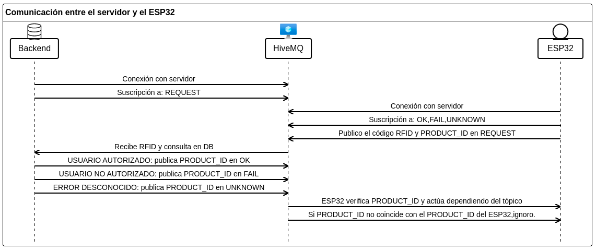

## Proyecto lector RFID con conexión mediante protocolo MQTT.

En este proyecto tenemos un lector de tarjetas RFID que publica las tarjetas leídas en un cierto tópico. Un servicio Backend recibe esa publicación, verifica que el código RFID pertenezca a un usuario autorizado y publica una respuesta.

### Documentacion: [link](https://exquisite-kangaroo-2adbdb.netlify.app/files.html)

## Conexión del modulo RFID    

En la configuración por defecto usamos el puerto SPI3 con los siguientes pines:
```

rc522_config_t config = {
    .spi.host = VSPI_HOST,
    .spi.miso_gpio = 25,
    .spi.mosi_gpio = 23, 
    .spi.sck_gpio = 19,
    .spi.sda_gpio = 22,
    .spi.device_flags= SPI_DEVICE_HALFDUPLEX
};
```

La placa utilizada para realizar las pruebas tiene la siguiente distribución de pines.


Revisar que su placa de desarrollo coincida con el siguiente pinout.


### Imagen del circuito montado


### Diagrama de funcionamiento del dispositivo.




## ESP32: lector RFID


### Suscripción

El dispositivo lector se conecta con el servidor [HiveMQ](https://www.hivemq.com/) para suscribirse a los siguientes tópicos:

```
#define RES_OK              "{PRODUCT_ID}/RES/OK"
#define RES_FAIL            "{PRODUCT_ID}/RES/FAIL"
#define RES_UNKNOWN         "{PRODUCT_ID}/RES/UNKNOWN"
```
 
### Publicaciones en REQUEST

Cuando el dispositivo lee una tarjeta RFID valida publica el código de la tarjeta `RFID` y su código de producto `PRODUCT_ID`


### Procesamiento de respuestas

#### Verifico PRODUCT_ID 
Cuando un mensaje llega el dispositivo verifica que el contenido del mensaje coincida con  el __PRODUCT_ID__. Si no lo hace, se ignora el mensaje  (es un mensaje para otro lector).


#### Realizar acciones
En caso de que el __PRODUCT_ID__ coincida, dependiendo del topico realizaremos las siguientes acciones:
-   __RES/OK__:  Imprimo usuario autorizado .
-   __RES/FAIL__: Imprimo usuario NO autorizado.
-   __RES/UNKNOWN__: Imprimo error inesperado.


## Backend 
El __Backend__ sera el encargado de recibir los mensajes provenientes de los dispositivos ESP32, verificar si el código `RFID` pertenece a un usuario autorizado  o no. En caso positivo el __Backend__ publicara como respuesta el `PRODUCT_ID` en el tópico `{PRODUCT_ID}/RES/OK`, caso contrario lo hara en `{PRODUCT_ID}/RES/FAIL`. En caso de error imprevisto en el servidor el mensaje sera publicado en `{PRODUCT_ID}/RES/UNKNOWN`.
